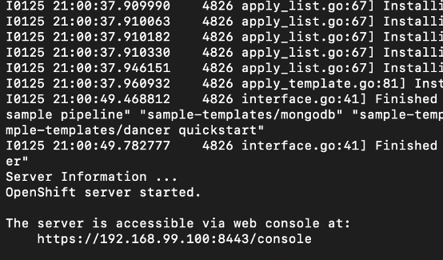

[![redhat][img-redhat]][url-redhat]

# Red Hat OpenShift Container Platform<br>


**Red Hat OpenShift** es una plataforma de contenedores de Kubernetes empresarial con operaciones automatizadas integrales para gestionar implementaciones de nube híbrida y multicloud. **Red Hat OpenShift** está optimizada para mejorar la productividad de los desarrolladores y promover la innovación.
* [![openshift][img-openshift]][url-openshift] Para mayor información.

# Minishift 101

# Indice:
* [PreWork](#PreWork)
* [Iniciar el servidor de OpenShift](#Iniciar-el-servidor-de-OpenShift)
* [Crear un proyecto](#Crear-un-proyecto)
* [Crear una app](#Crear-una-app)
* [Exponer aplicaciones OpenShift](#Exponer-aplicaciones-OpenShift)

## PreWork:<br>
Para instalar un **Hypervisor** para la creación de un cluster en **OpenShift**.
<br>

**Hypervisor** dependiendo del sistema operativo:
* Para Linux: [KVM driver][url-kvm]
* Para macOS: [hyperkit driver][url-hyper]
* Para Windows: [Hyper-V driver][url-hyperv]
* Para VirtualBox (all platforms): [Minishift para VirtualBox][url-VBminishift]
<br>

Para descargar **Minishift**: [Minishift][url-minishift]
<br>

## Iniciar el servidor de OpenShift:<br>
Para iniciar el servidor de **OpenShift** podemos usar en la terminal:

1. Si solo has instalado uno, bastará que solo usemos lo siguiente.
``` bash
minishift start
```

2. Si tienes instalado más de uno, entonces usamos:
``` bash
minishift start --vm-driver <driver>
```
**"driver"** es el driver que queremos iniciar para crear el ambiente virtualizado donde se creará el cluster de **OpenShift**. Ej. ‘hyperkit’ o ‘virtualbox’.

Una vez hecho esto te debera aparecer la dirección de la UI de **OpenShift** el cual por ahora no haremos caso ya que haremos todo el workshop desde la terminal.
<br>

<br>

Teclea el siguiente comando para logearte en el cluster como administrador.
``` bash
oc login -u system:admin
```

Si te aparece que el comando ‘oc’ no lo ha encontrado, teclea lo siguiente para cargar el comando en el ambiente de trabajo actual.
``` bash
eval $(minishift oc-env)
``` 


## Crear un Proyecto.<br>
Al momento de logearnos temenos un proyecto por default. De todas formas crearemos uno con el siguiente comando.
``` bash
oc new-project <project_name> --description="<description>" --display-name="<display_name>"
```

Crearemos un nuevo proyecto llamado "hello-openshift" con el siguente comando:
``` bash
oc new-project hello-openshift --description="This is an example project to demonstrate OpenShift v3" --display-name="Hello OpenShift"
```


## Crear una app.<br>
Hay varias formas de crear una app en **OpenShift**.
* Desde código fuente.
* Desde imágenes **DockerHub**.
* Desde templates de **OpenShift**.
* Desde la UI de **OpenShift**.
En este workshop desplegaremos una app Node.js de muestra en cuál dicho código fuente se encuentra en un repositorio de **OpenShift**(que son templates de Openshift) en **GitHub**. Por lo tanto estaremos creando la app desde código fuente.
<br>
Usamos el siguiente comando:
`` bash
oc new-app https://github.com/ibmdevelopermx/minishift-101
```
<br>

Puedes monitorear la construcción (que OpenShift hace de manera automática) de la app con el siguiente comando:
``` bash
oc logs -f bc/minishift-101
```


## Exponer aplicaciones OpenShift
Para exponer el servicio usamos:
``` bash
oc expose svc/minishift-101
```
<br>

Para obtener la ruta usamos:
``` bash
oc get route/minishift-101
```
<br>


<br>

Nos dirigimos en cualquier buscador a la ruta que salió en "HOST/PORT" para probar la aplicación.

Ej. ‘nodejs-ex-hello-openshift.192.168.99.100.nip.io’


[img-redhat]: https://img.shields.io/badge/Red%20Hat-Powered-red.svg
[url-redhat]: https://www.redhat.com/es
[img-openshift]: https://img.shields.io/badge/Red%20Hat-Open%20Shift-red.svg
[url-openshift]: https://www.redhat.com/es/technologies/cloud-computing/openshift?intcmp=701f2000001OEGrAAO
[url-kvm]: https://docs.okd.io/latest/minishift/getting-started/setting-up-virtualization-environment.html#setting-up-kvm-driver
[url-hyper]: https://docs.okd.io/latest/minishift/getting-started/setting-up-virtualization-environment.html#setting-up-hyperkit-driver
[url-hyperv]: https://docs.okd.io/latest/minishift/getting-started/setting-up-virtualization-environment.html#setting-up-hyperkit-driver
[url-VBminishift]: https://docs.okd.io/latest/minishift/getting-started/setting-up-virtualization-environment.html#setting-up-virtualbox-driver
[url-minishift]: https://docs.okd.io/latest/minishift/getting-started/installing.html